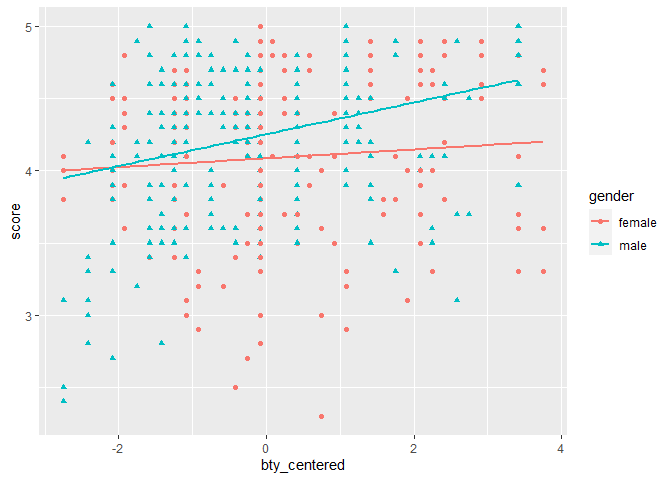

Lab 10 - Grading the professor, Pt. 2
================
Ben Hardin
3/14/2023

### Load packages and data

``` r
library(tidyverse) 
library(tidymodels)
library(openintro)
```

### Exercise 1

The linear model: score = 3.88 + .067(average beauty)

R^2 = 3.5% Adjusted R^2 = 3.3%

``` r
m_bty <- linear_reg() %>%
  set_engine("lm") %>%
  fit(score ~ bty_avg, data = evals)

tidy(m_bty)
```

    ## # A tibble: 2 × 5
    ##   term        estimate std.error statistic   p.value
    ##   <chr>          <dbl>     <dbl>     <dbl>     <dbl>
    ## 1 (Intercept)   3.88      0.0761     51.0  1.56e-191
    ## 2 bty_avg       0.0666    0.0163      4.09 5.08e-  5

``` r
glance(m_bty)$r.squared
```

    ## [1] 0.03502226

``` r
glance(m_bty)$adj.r.squared
```

    ## [1] 0.03292903

### Exercise 2

The linear model: score = 3.75 + .07(beauty) + .17(gender)

R^2 = 5.9% Adjusted R^2 = 5.5%

``` r
m_bty_gen <- linear_reg() %>%
  set_engine("lm") %>%
  fit(score ~ bty_avg + gender, data = evals)

tidy(m_bty_gen)
```

    ## # A tibble: 3 × 5
    ##   term        estimate std.error statistic   p.value
    ##   <chr>          <dbl>     <dbl>     <dbl>     <dbl>
    ## 1 (Intercept)   3.75      0.0847     44.3  6.23e-168
    ## 2 bty_avg       0.0742    0.0163      4.56 6.48e-  6
    ## 3 gendermale    0.172     0.0502      3.43 6.52e-  4

``` r
glance(m_bty_gen)$r.squared
```

    ## [1] 0.05912279

``` r
glance(m_bty_gen)$adj.r.squared
```

    ## [1] 0.05503202

### Exercise 3

Intercept: Female instructors who have a beauty rating of 0 are
predicted, on average, to receive a course evaluation score of about
3.75

Slope of gender: Holding beauty constant, course evaluation scores are
predicted, on average, to be .17 points higher for male instructors
compared to female instructors.

### Exercise 4

The model including average beauty and gender explains about 5.9% of the
variance in course evaluation scores.

### Exercise 5

Linear model for male instructors: score = 3.92 + .07(beauty)

### Exercise 6

For two professors who had the same beauty rating, this model predicts
that male professors would have higher course evaluation scores.

### Exercise 7

This is a question about an interaction, but I only tested main effects
in my previous model. So now, let’s run a model including the
interaction term to answer this question.

``` r
evals <- evals %>%
  mutate(bty_centered = (bty_avg - mean(bty_avg)))

m_bty_gen <- linear_reg() %>%
  set_engine("lm") %>%
  fit(score ~ bty_centered * gender, data = evals)

tidy(m_bty_gen)
```

    ## # A tibble: 4 × 5
    ##   term                    estimate std.error statistic  p.value
    ##   <chr>                      <dbl>     <dbl>     <dbl>    <dbl>
    ## 1 (Intercept)               4.09      0.0381    107.   0       
    ## 2 bty_centered              0.0306    0.0240      1.28 0.202   
    ## 3 gendermale                0.168     0.0500      3.37 0.000826
    ## 4 bty_centered:gendermale   0.0796    0.0325      2.45 0.0146

``` r
glance(m_bty_gen)$r.squared
```

    ## [1] 0.07128874

``` r
glance(m_bty_gen)$adj.r.squared
```

    ## [1] 0.06521873

``` r
ggplot(evals, aes(x = bty_centered, y = score, color = gender))+
  geom_point(aes(shape = gender))+
  geom_smooth(method = "lm", se = F)
```

    ## `geom_smooth()` using formula = 'y ~ x'

<!-- -->

The slope of the interaction is about .08, indicating that the slope for
beauty predicting course evaluation scores differs between male versus
female instructors. Specifically, the slope for beauty is predicted to
be about .08 points greater for male instructors than for female
instructors, meaning there is a stronger relationship between beauty and
course evaluations for male instructors than for female instructors.

### Exercise 8

…

### Exercise 9

…

### Exercise 10

``` r
m_bty_rank <- linear_reg() %>%
  set_engine("lm") %>%
  fit(score ~ bty_avg + rank, data = evals)

tidy(m_bty_rank)
```

    ## # A tibble: 4 × 5
    ##   term             estimate std.error statistic   p.value
    ##   <chr>               <dbl>     <dbl>     <dbl>     <dbl>
    ## 1 (Intercept)        3.98      0.0908     43.9  2.92e-166
    ## 2 bty_avg            0.0678    0.0165      4.10 4.92e-  5
    ## 3 ranktenure track  -0.161     0.0740     -2.17 3.03e-  2
    ## 4 ranktenured       -0.126     0.0627     -2.01 4.45e-  2

### Exercise 11

Level

### Exercise 12

``` r
m_level <- linear_reg() %>%
  set_engine("lm") %>%
  fit(score ~ cls_level, data = evals)

tidy(m_level)
```

    ## # A tibble: 2 × 5
    ##   term           estimate std.error statistic   p.value
    ##   <chr>             <dbl>     <dbl>     <dbl>     <dbl>
    ## 1 (Intercept)      4.24      0.0433     97.9  1.40e-310
    ## 2 cls_levelupper  -0.0961    0.0533     -1.80 7.20e-  2

### Exercise 13

Kick out did eval

### Exercise 14

``` r
m_full <- linear_reg() %>%
  set_engine("lm") %>%
  fit(score ~ rank + ethnicity + gender + language + age + cls_perc_eval + cls_students + cls_level + cls_profs + cls_credits + bty_avg, data = evals)

tidy(m_full)
```

    ## # A tibble: 13 × 5
    ##    term                   estimate std.error statistic  p.value
    ##    <chr>                     <dbl>     <dbl>     <dbl>    <dbl>
    ##  1 (Intercept)            3.53      0.241       14.7   4.65e-40
    ##  2 ranktenure track      -0.107     0.0820      -1.30  1.93e- 1
    ##  3 ranktenured           -0.0450    0.0652      -0.691 4.90e- 1
    ##  4 ethnicitynot minority  0.187     0.0775       2.41  1.63e- 2
    ##  5 gendermale             0.179     0.0515       3.47  5.79e- 4
    ##  6 languagenon-english   -0.127     0.108       -1.17  2.41e- 1
    ##  7 age                   -0.00665   0.00308     -2.16  3.15e- 2
    ##  8 cls_perc_eval          0.00570   0.00155      3.67  2.68e- 4
    ##  9 cls_students           0.000445  0.000358     1.24  2.15e- 1
    ## 10 cls_levelupper         0.0187    0.0556       0.337 7.37e- 1
    ## 11 cls_profssingle       -0.00858   0.0514      -0.167 8.67e- 1
    ## 12 cls_creditsone credit  0.509     0.117        4.35  1.70e- 5
    ## 13 bty_avg                0.0613    0.0167       3.67  2.68e- 4

``` r
glance(m_full)$r.squared
```

    ## [1] 0.1635232

``` r
glance(m_full)$adj.r.squared
```

    ## [1] 0.1412172

### Exercise 15

``` r
m_final <- linear_reg() %>%
  set_engine("lm") %>%
  fit(score ~ rank + ethnicity + gender + language + age + cls_perc_eval + cls_credits + bty_avg, data = evals)

tidy(m_final)
```

    ## # A tibble: 10 × 5
    ##    term                  estimate std.error statistic  p.value
    ##    <chr>                    <dbl>     <dbl>     <dbl>    <dbl>
    ##  1 (Intercept)            3.59      0.234      15.3   4.70e-43
    ##  2 ranktenure track      -0.103     0.0817     -1.26  2.10e- 1
    ##  3 ranktenured           -0.0314    0.0640     -0.490 6.24e- 1
    ##  4 ethnicitynot minority  0.194     0.0754      2.58  1.03e- 2
    ##  5 gendermale             0.183     0.0510      3.59  3.62e- 4
    ##  6 languagenon-english   -0.131     0.106      -1.23  2.20e- 1
    ##  7 age                   -0.00685   0.00306    -2.24  2.58e- 2
    ##  8 cls_perc_eval          0.00501   0.00144     3.48  5.49e- 4
    ##  9 cls_creditsone credit  0.499     0.112       4.47  9.78e- 6
    ## 10 bty_avg                0.0646    0.0164      3.94  9.47e- 5

``` r
glance(m_final)$r.squared
```

    ## [1] 0.1605361

``` r
glance(m_final)$adj.r.squared
```

    ## [1] 0.143858
